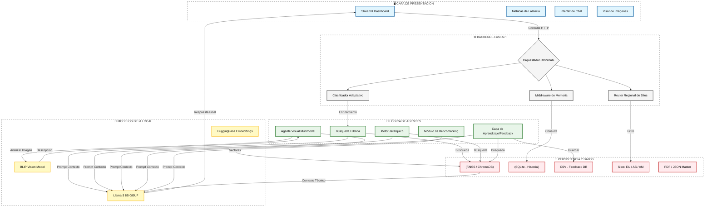

# 🏙️ OmniRAG: Ecosistema Agéntico SmartCity

**Ecosistema de Inteligencia Artificial Local (Llama-3 8B) para gestión de infraestructura urbana.**

  <em>"Donde el dato se convierte en decisión: Un ecosistema agéntico diseñado para que las ciudades no solo procesen información, sino que aprendan, vean y recuerden"</em>

**Desarrollado por: Msc. Yanet Cesaire Velazquez**

## 📂 Documentación Técnica

Para conocer los detalles de arquitectura, desafíos técnicos superados y comparativas de rendimiento:

👉 [**Descargar Informe Técnico Completo (PDF)**](./documentos/Informe_Tecnico.pdf)

*Nota: Este repositorio es un portafolio de arquitectura y diseño de sistemas de IA. El código fuente es de propiedad privada de la autora.*

## 💡 Decisiones de Ingeniería y Preguntas Clave

En el desarrollo de este ecosistema, se priorizaron decisiones arquitectónicas que responden a necesidades reales del sector industrial y gubernamental. Aquí las respuestas a los pilares fundamentales del proyecto:

### ¿Por qué una implementación 100% Local (On-Premise)?

La elección de no utilizar APIs externas (como OpenAI o Anthropic) se basa en tres pilares estratégicos:

*   **Privacidad Absoluta:** Los datos sensibles de la infraestructura urbana y seguridad ciudadana nunca salen de la red privada.

*   **Cero Costo Operativo:** Eliminación de costos por token, permitiendo consultas ilimitadas sobre documentos masivos sin presupuesto variable.

*   **Soberanía Tecnológica:** El sistema es resiliente y funcional incluso en entornos con conectividad nula o restringida.

### ¿Cuál fue el desafío técnico más complejo?

El reto principal fue la implementación de la **Persistencia Contextual (Memoria)**. Lograr que una IA pase de ser un motor de búsqueda amnésico a un asistente operativo capaz de recordar, razonar sobre el pasado y resolver correferencias mediante **SQLite**, fue el salto cualitativo que transformó una herramienta de consulta en un agente de decisión real.

Este proyecto es un caso de estudio sobre la implementación de **10 estrategias avanzadas de RAG (Recuperación Aumentada por Generación)** para resolver problemas complejos de una **"Ciudad Inteligente"**.

## 🛠️ Implementación Técnica: Ecosistema OmniRAG SmartCity

1. **RAG Básico:** Búsqueda semántica estándar.

2. **RAG Jerárquico:** Estructura Padre-Hijo para manuales extensos.

3. **RAG con Agentes:** Toma de decisiones con herramientas en vivo.

4. **RAG de Memoria:** Persistencia histórica con SQLite.

5. **RAG Multimodal:** Análisis de imágenes con modelos BLIP.

6. **RAG con Retroalimentación:** Aprendizaje continuo por feedback humano.

7. **RAG Distribuido:** Enrutamiento inteligente a silos regionales (Europa, Asia, América).

8. **RAG Híbrido:** Precisión del 100% en códigos SKU (Vectores + Keyword).

9. **RAG Adaptativo:** Clasificador de intención (Nivel 1 vs Nivel 2).

10. **Benchmarking PDF:** Pruebas de estrés con documentos de +200 páginas (Usamos en la comparación **ChromaDB  y Faiss**).

## 🏗️  Arquitectura del Sistema: OmniRAG SmartCity  

El ecosistema opera bajo una filosofía de IA Agéntica Modular, donde cada componente cumple una función específica dentro de la cadena de valor del dato:

**Capa de Presentación (Streamlit):** Interfaz reactiva que gestiona el estado de la sesión, renderizado de telemetría (métricas de latencia) y visualización de evidencias multimodales.

**Capa de Orquestación (FastAPI):** Núcleo asíncrono que actúa como "Traffic Controller", gestionando el enrutamiento inteligente, la inyección de memoria histórica y la seguridad de los endpoints.

**Capa de Inteligencia (Agentic Logic):** Conjunto de 10 estrategias RAG que procesan la información mediante lógica condicional, búsqueda híbrida y clasificación de intención.

**Capa de Persistencia (Hybrid Storage):** Almacenamiento segmentado que utiliza FAISS para velocidad ultra-rápida, ChromaDB para gestión de metadatos y SQLite para integridad referencial del historial.

## 🌲 Estructura del Directorio

A continuación se detalla la organización modular de los microservicios y bases de datos:

## 🌐 Infraestructura de Backend: Microservicios con FastAPI

En este ecosistema, FastAPI actúa como el sistema nervioso central, orquestando de forma asíncrona la comunicación entre la interfaz de usuario y los modelos de IA locales. Su arquitectura modular se divide en cinco responsabilidades críticas:

**1. Motor de Orquestación Agéntica (Inference Engine)**

Gestiona el ciclo de vida de cada consulta, seleccionando dinámicamente la estrategia de recuperación (Básica, Jerárquica o Híbrida) mediante prompts dinámicos. Optimiza la comunicación con Llama-3 8B, garantizando una generación de texto fluida y coherente.

**2. Enrutamiento Inteligente (Intelligent Router)**

Implementa la lógica del RAG Adaptativo y Distribuido. Analiza la intención del usuario y las entidades geográficas para dirigir la petición al nivel de complejidad adecuado (FAQ vs. Análisis) o al silo regional correspondiente (Asia, Europa, América), minimizando el sobrecoste computacional en la CPU.

**3. Pipeline de Visión y Datos Multimodales**

Responsable de la ingesta y procesamiento de datos no estructurados. Utiliza el modelo BLIP para transformar imágenes de infraestructura en reportes técnicos textuales, los cuales son indexados vectorialmente para habilitar búsquedas semánticas sobre evidencias visuales.

**4. Gestión de Estado y Persistencia (State Management)**

Garantiza la continuidad lógica de las interacciones mediante la integración con SQLite. Este servicio gestiona el historial de chat para eliminar la "amnesia" del modelo y procesa la capa de Feedback, permitiendo que el sistema aprenda de correcciones humanas en tiempo real.

**5. Servicio de Telemetría y Benchmarking**

Microservicio especializado en observabilidad. Captura y expone métricas de latencia granular — diferenciando tiempos de Retrieval (FAISS/ChromaDB) y de Generación (LLM) — para su análisis comparativo de rendimiento en el panel de control.

**✨ Beneficios de la implementación:**

**Asincronía Total:** Manejo eficiente de tareas intensivas de IA sin bloquear la experiencia de usuario.

**Modularidad:** Capacidad de escalar o sustituir agentes RAG de forma independiente.

## 🛠️ Stack Tecnológico

**LLM: Llama-3 8B (Local/Quantized)**

**Orquestación: FastAPI & LangChain**

**Bases de Datos: FAISS, ChromaDB, SQLite**

**Visión: BLIP (Salesforce)**

**Interfaz: Streamlit (Custom CSS)**

**Embeddings: HuggingFace / sentence-transformers**

**Lenguaje de Programación: Python**

## 🖥️ Prototipo de Interfaz

He diseñado un dashboard interactivo utilizando **Streamlit** que permite al operador de la SmartCity alternar entre los 10 agentes RAG de forma fluida.

**Ejemplos: RAG Multimodal**

**Ejemplos: RAG con Retroalimentación (Feedback)**

El sistema genera una respuesta con Llama 8B y permite que el usuario la vote (👍/👎).

**Ejemplos: RAG con Híbrida**

