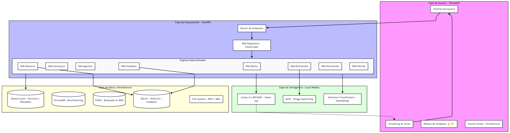
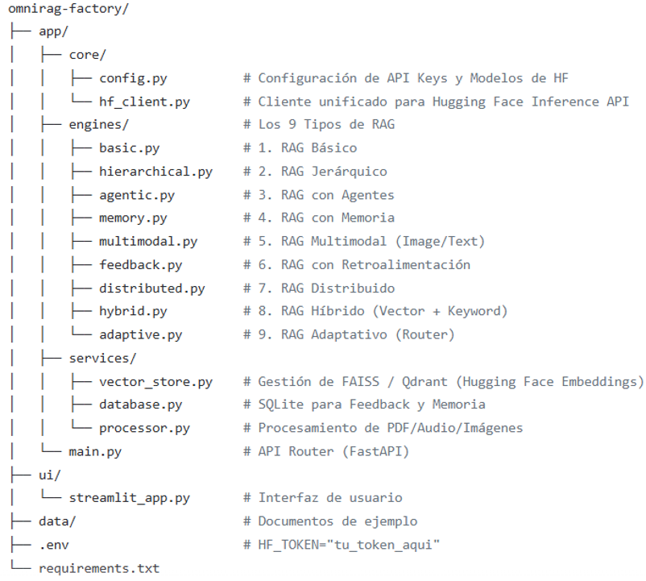

# 🏙️ OmniRAG: Ecosistema Agéntico SmartCity

**Ecosistema de Inteligencia Artificial Local (Llama-3 8B) para gestión de infraestructura urbana.**

**Desarrollado por: Msc. Yanet Cesaire Velazquez**

## 📂 Documentación Técnica

Para conocer los detalles de arquitectura, desafíos técnicos superados y comparativas de rendimiento:

👉 [**Descargar Informe Técnico Completo (PDF)**](./documentos/Informe_Tecnico.pdf)

*Nota: Este repositorio es un portafolio de arquitectura y diseño de sistemas de IA. El código fuente es de propiedad privada de la autora.*

Este proyecto es un caso de estudio sobre la implementación de **10 estrategias avanzadas de RAG** (Recuperación Aumentada por Generación) para resolver problemas complejos de una Ciudad Inteligente.

## 🚀 Las 10 Estrategias Implementadas

1. **RAG Básico:** Búsqueda semántica estándar.

2. **RAG Jerárquico:** Estructura Padre-Hijo para manuales extensos.

3. **RAG con Agentes:** Toma de decisiones con herramientas en vivo.

4. **RAG de Memoria:** Persistencia histórica con SQLite.

5. **RAG Multimodal:** Análisis de imágenes con modelos BLIP.

6. **RAG con Retroalimentación:** Aprendizaje continuo por feedback humano.

7. **RAG Distribuido:** Enrutamiento inteligente a silos regionales (Europa, Asia, América).

8. **RAG Híbrido:** Precisión del 100% en códigos SKU (Vectores + Keyword).

9. **RAG Adaptativo:** Clasificador de intención (Nivel 1 vs Nivel 2).

10. **Benchmarking PDF:** Pruebas de estrés con documentos de +200 páginas (Usamos en la comparación **ChromaDB  y Faiss**).

Esta arquitectura representa un sistema de IA de Grado Industrial. Se basa en el desacoplamiento de responsabilidades: el **Frontend** gestiona la experiencia,el **Backend** orquesta la lógica, y los **Engines** ejecutan las estrategias específicas de RAG.

Este es un proyecto a gran escala. Para mantenerlo manejable y profesional, utilizaremos una arquitectura modular donde cada tipo de RAG es un **Motor** (Engine) independiente, orquestado por FastAPI y visualizado con Streamlit, utilizando exclusivamente el 
ecosistema de **Hugging Face (Transformers, Datasets, Inference API)**.

## 🌐 Microservicios con FastAPI: El Cerebro del Sistema

En este proyecto, FastAPI actúa como la capa de backend de alto rendimiento, encargada de gestionar la lógica de los 10 agentes RAG de forma modular. Sus principales funciones son:

**1. Orquestación Agéntica (Inference Engine)**

El microservicio central recibe las consultas del usuario y decide, mediante lógica de programación y prompts dinámicos, qué estrategia de recuperación activar (Básica, Jerárquica o Híbrida). Gestiona la comunicación directa con el modelo Llama-3 8B de forma eficiente, controlando los tiempos de generación.

**2. Enrutamiento Inteligente (Router Service)**

Implementa la lógica del RAG Adaptativo y Distribuido. Este componente analiza la intención de la pregunta y la región geográfica mencionada para dirigir la petición al silo de datos correcto (Europa, Asia, América) o al nivel de complejidad adecuado (FAQ vs. Análisis Profundo), optimizando el uso de recursos de la CPU.

**3. Procesamiento Multimodal y Visión**

Este microservicio integra el modelo de visión BLIP. Se encarga de la ingesta de imágenes, la extracción de metadatos técnicos y la conversión de píxeles a descripciones textuales que luego son indexadas en la base de datos vectorial para su búsqueda por lenguaje natural.

**4. Gestión de Persistencia y Memoria (State Management)**

Responsable de la conexión con SQLite y archivos de Feedback. Este servicio asegura que cada interacción se guarde correctamente, permitiendo que la IA "recuerde" el contexto del usuario y que el sistema aprenda de las correcciones humanas mediante el procesamiento de archivos CSV en tiempo real.

**5. API de Benchmarking y Métricas**

Un servicio especializado en el análisis de rendimiento. Captura las latencias de búsqueda (Retrieval) y de generación (LLM) de motores como FAISS y ChromaDB, exponiendo estos datos a través de endpoints específicos para su visualización técnica en el dashboard.

## 🛠️ Stack Tecnológico

**LLM: Llama-3 8B (Local/Quantized)**

**Orquestación: FastAPI & LangChain**

**Bases de Datos: FAISS, ChromaDB, SQLite**

**Visión: BLIP (Salesforce)**

**Interfaz: Streamlit (Custom CSS)**

**Embeddings: HuggingFace / sentence-transformers**

## 🖥️ Prototipo de Interfaz

He diseñado un dashboard interactivo utilizando **Streamlit** que permite al operador de la SmartCity alternar entre los 10 agentes RAG de forma fluida.

**Ejemplos: RAG Multimodal**

**Ejemplos: RAG con Retroalimentación (Feedback)**

El sistema genera una respuesta con Llama 8B y permite que el usuario la vote (👍/👎).

**Ejemplos: RAG con Híbrida**

